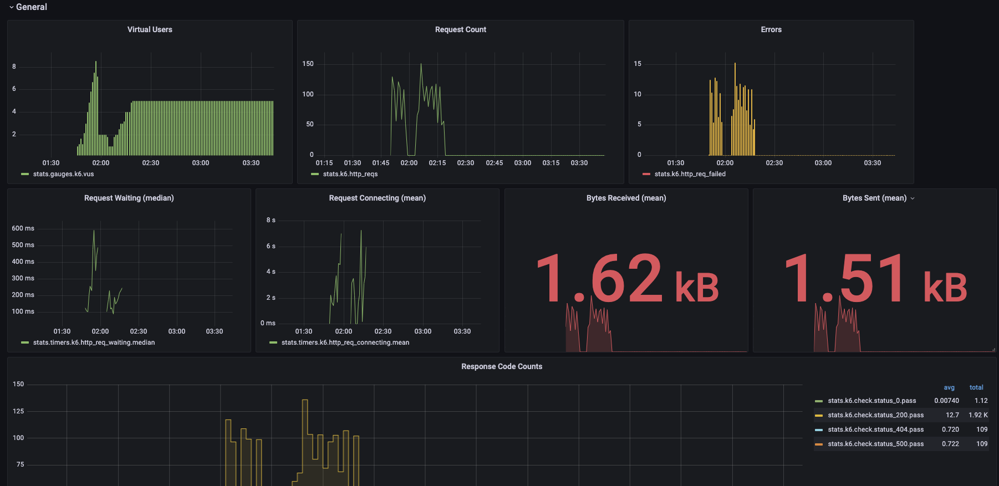
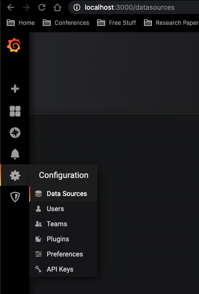
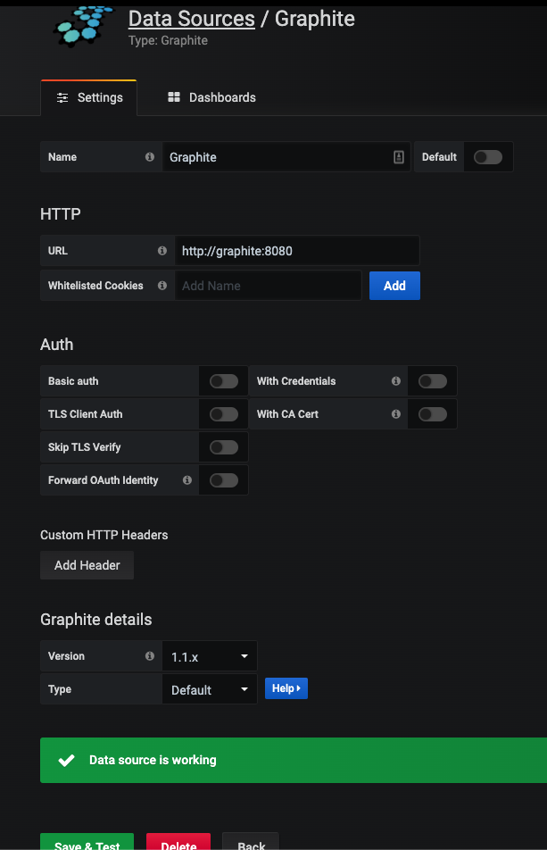

## Description
A template repository for setting up a load testing tool called k6 and visualizing it later using grafana.
Some visualization examples are already prepared in this repository for ease of use.



##  Installation
```$xslt
npm install
brew tap loadimpact/k6
brew install k6
docker-compose up
```

##  Running Tests
```
# Creates k6 as the namespace when using grafana or graphite
`k6 run src/run.js --out statsd`
# If you want to change statsd namespace
K6_STATSD_ADDR='localhost:8125' K6_STATSD_NAMESPACE='custom_name_space' k6 run src/run.js --out statsd
```

## Tested k6 Versions
- [x] 0.35

## Setup Grafana Data Source Manually
1. Visit *http://localhost:3000* on your browser. Login using credentials: admin/password
2. On left hand panel, click on the gear and set up data source.
- 

3. Enter the data source information and save.
- 

## References
- https://docs.k6.io/docs/running-k6
- https://github.com/grafana/k6/releases
- https://grafana.com/
- https://github.com/statsd/statsd
- https://k6.io/blog/how-to-do-10-things-in-jmeter-vs-k6
